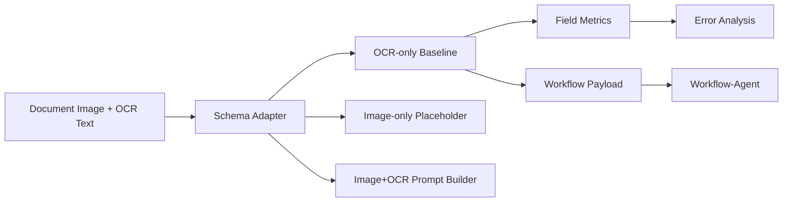

# FlowDoc-VLM

FlowDoc-VLM is a document-image field extraction and multimodal evaluation project for enterprise workflow scenarios.

The current week-2 MVP adds real-data adapters, instruction-answer data building, and VLM inference baseline scaffolding on top of the OCR-only evaluation pipeline. It does not run LoRA SFT, DPO, Triton optimization, or any large-model training.

## Naming

This project is named **FlowDoc-VLM**. It does not reproduce the existing DocVLM paper, does not claim a new document VLM architecture, and does not use the name DocVLM-FlowBench to avoid confusion with prior work.

## Why Enterprise Documents

Enterprise workflows often depend on uploaded forms, receipts, invoices, contracts, and access request screenshots. Workflow-Agent can move approval or ticket states, while FlowDoc-VLM extracts structured fields from document images and OCR text so the downstream workflow can validate risk, route human approval, and send notifications.

## Why Not Just OCR

FlowDoc-VLM is not a replacement for OCR. OCR-only is included as a baseline. The project studies where VLM-style document understanding can complement OCR/KIE:

- low-quality scans
- non-standard layouts
- missing or ambiguous field names
- multiple amount fields such as subtotal, tax, and total
- layout understanding after OCR structure is lost
- handwriting, stamps, and dense tables where field ownership is unclear

## Datasets

The week-1 MVP supports local CSV and mock fallback data. The generated mock set includes deliberately hard cases so the OCR-only baseline is not unrealistically perfect:

- subtotal, tax, total, amount due, and weak total labels
- invoice date and due date in the same OCR text
- vendor, company, client, and merchant names in the same document
- natural-language permission scope descriptions
- OCR lines with order different from the visual layout
- missing fields and non-standard labels

Adapters are included for DocVQA-like, FUNSD-like, SROIE-like, and local unified CSV records. Local CSV files can be read from `data/raw/*.csv` and converted into `data/processed/*.csv`. Missing image files are marked with `image_exists=false`; the original `image_path` value is preserved for later environment-specific resolution.

Recommended datasets:

- DocVQA: document visual question answering
- FUNSD: form understanding with entities and relations
- SROIE: scanned receipt OCR and key information extraction
- CORD: optional later expansion

Unified CSV columns are: `sample_id`, `doc_id`, `doc_type`, `image_path`, `question`, `answer`, `field_name`, `field_type`, `ocr_text`, `bbox`, `source_dataset`, and `image_exists`.

## Flow



## Quick Start

```bash
python -m pip install -e ".[dev]"
python scripts/prepare_mock_data.py
python scripts/run_field_eval.py
python scripts/export_error_cases.py
python scripts/build_instruction_data.py --input data/processed/mock_qa.csv --strategy image_ocr --output data/processed/instructions_mock_image_ocr.jsonl
python scripts/split_instruction_data.py --input data/processed/instructions_mock_image_ocr.jsonl --train-output data/processed/train_instructions.jsonl --eval-output data/processed/eval_instructions.jsonl --eval-ratio 0.2 --seed 42
python scripts/check_vlm_env.py
python scripts/run_vlm_baseline.py --input data/processed/mock_qa.csv --strategy image_ocr --backend dummy --output outputs/metrics/vlm_baseline_dummy_image_ocr.json
python scripts/compare_baselines.py
python scripts/demo_workflow_integration.py
python -m pytest -q
```

If `WORKFLOW_AGENT_URL` is set, the workflow demo will POST to that service. Otherwise it saves `outputs/workflow_payloads/payload.json` so the demo works offline.

## Current Capabilities

- unified Pydantic schema for VQA and field extraction samples
- mock document PNG and CSV generation
- local CSV adapter plus DocVQA/FUNSD/SROIE-like converters
- OCR-only rule baseline using `ocr_text`
- image-only placeholder with explicit unsupported status and no fabricated VLM metric
- instruction-answer JSONL construction for `ocr_only`, `image_only`, and `image_ocr`
- Qwen2.5-VL, LLaVA, and dummy VLM runner interfaces
- VLM baseline script with skipped metrics when the model environment is unavailable
- AutoDL runbook plus SFT readiness checks that do not start training
- exact match, normalized exact match, regex match, field accuracy, per-field accuracy, missing field rate, and multi-value conflict rate
- error case CSV export plus `outputs/error_cases/analysis_report.md`
- Workflow-Agent payload builder and optional client POST
- CPU-only pytest coverage without model downloads or API keys

`field_level_accuracy` is a baseline validation number on the current mock data, not the final model capability of FlowDoc-VLM. The deliberately hard mock cases are meant to expose common OCR-only failures before image+OCR prompting or VLM-SFT is introduced.

## Week 2 Plan

- prepare real-data-like CSV adapters for FUNSD, SROIE, DocVQA, and local unified records
- build answer-only instruction JSONL for `ocr_only`, `image_only`, and `image_ocr`
- scaffold Qwen2.5-VL and LLaVA inference runners without downloading models in tests
- compare OCR-only and VLM inference baselines, marking unavailable model runs as `skipped=true`
- keep LoRA SFT for week 3 or later

## Input Strategies

- `ocr_only`: question plus OCR text, no image content.
- `image_only`: image path plus question, no OCR text.
- `image_ocr`: image path plus question plus OCR text.

If a real Qwen2.5-VL or LLaVA environment is not installed, `run_vlm_baseline.py` writes `skipped=true` with a clear `skip_reason` and leaves accuracy fields as `null`. The dummy backend is always skipped and is only for pipeline validation.

## Run Qwen2.5-VL Smoke Baseline

Start with an environment check. This does not download a model:

```bash
python scripts/check_vlm_env.py
```

Run the dummy pipeline check:

```bash
python scripts/run_vlm_baseline.py --input data/processed/mock_qa.csv --strategy image_ocr --backend dummy --output outputs/metrics/vlm_baseline_dummy_image_ocr.json
```

Run a Qwen2.5-VL smoke test with the default Hugging Face repo id:

```bash
python scripts/run_vlm_baseline.py --input data/processed/mock_qa.csv --strategy image_ocr --backend qwen2_5_vl --model-name Qwen/Qwen2.5-VL-3B-Instruct --max-samples 3 --smoke-test --output outputs/metrics/vlm_baseline_qwen_image_ocr_smoke.json
```

Run the same smoke test with a local model path:

```bash
python scripts/run_vlm_baseline.py --input data/processed/mock_qa.csv --strategy image_ocr --backend qwen2_5_vl --model-name E:\models\Qwen2.5-VL-3B-Instruct --max-samples 3 --smoke-test --output outputs/metrics/vlm_baseline_qwen_local_image_ocr_smoke.json
```

If dependencies, model files, network access, image files, or GPU resources are unavailable, the result is `skipped=true` with a `skip_reason`. A skipped result is an environment or availability status, not evidence that the model is inaccurate. Skipped runs must not be reported as real VLM metrics. Prediction postprocessing only strips common answer prefixes and lightly extracts amount/date/id values for evaluation normalization; it is not a substitute for model correctness.

## AutoDL Qwen2.5-VL Run

See [docs/autodl_qwen_vl_runbook.md](docs/autodl_qwen_vl_runbook.md) for the full AutoDL setup and troubleshooting guide. The recommended order is smoke baseline first, LoRA later:

```bash
python scripts/check_vlm_env.py
python scripts/prepare_mock_data.py
python scripts/build_instruction_data.py --input data/processed/mock_qa.csv --strategy image_ocr --output data/processed/instructions_mock_image_ocr.jsonl
python scripts/run_vlm_baseline.py --input data/processed/mock_qa.csv --strategy image_ocr --backend qwen2_5_vl --model-name /root/autodl-tmp/models/Qwen2.5-VL-3B-Instruct --max-samples 3 --smoke-test --output outputs/metrics/vlm_baseline_qwen_image_ocr_smoke.json
```

Before any LoRA SFT attempt, split the instruction data and run readiness checks:

```bash
python scripts/split_instruction_data.py --input data/processed/instructions_mock_image_ocr.jsonl --train-output data/processed/train_instructions.jsonl --eval-output data/processed/eval_instructions.jsonl --eval-ratio 0.2 --seed 42
python scripts/check_sft_readiness.py --instruction-file data/processed/instructions_mock_image_ocr.jsonl --model-name /root/autodl-tmp/models/Qwen2.5-VL-3B-Instruct --baseline-metrics outputs/metrics/vlm_baseline_qwen_image_ocr_smoke.json
```

Current mock data is intentionally too small for meaningful SFT. Do not train directly from the 39 mock QA rows; first obtain a real Qwen2.5-VL image+OCR baseline, enough instruction samples, valid image paths, train/eval split, CUDA, and required training packages.

## Qwen2.5-VL LoRA SFT Dry Run

The AutoDL zero-shot baselines currently provide the reference point before any training:

- OCR-only rule baseline: `field_level_accuracy=0.769`
- Qwen2.5-VL image-only: `field_level_accuracy=0.692`
- Qwen2.5-VL image+OCR: `field_level_accuracy=0.718`
- Qwen2.5-VL OCR-only: `field_level_accuracy=0.744`

The LoRA script is an engineering dry-run scaffold, not a claim of model improvement:

```bash
python scripts/train_qwen_vl_lora.py --model-name /root/autodl-tmp/models/Qwen/Qwen2___5-VL-3B-Instruct --train-file data/processed/train_instructions.jsonl --eval-file data/processed/eval_instructions.jsonl --output-dir outputs/lora/qwen2_5_vl_flowdoc_dryrun --dry-run
```

Without `--dry-run`, the script attempts a tiny LoRA run with PEFT and writes `outputs/metrics/lora_dryrun_train_log.json`. The default settings are intentionally small: `max_steps=10`, `batch_size=1`, `gradient_accumulation_steps=4`, `lora_r=8`, `lora_alpha=16`, `learning_rate=1e-4`, `max_train_samples=20`, and `max_eval_samples=8`.

Current limitations:

- The 39 mock instruction rows are too small and will overfit.
- The dry-run validates data loading, arguments, logging, and answer-only label masking; it does not prove model quality.
- User prompt, OCR text, and prompt tokens are masked from loss in the text token sequence, but Qwen2.5-VL image token masking is marked as best-effort and must be audited before formal SFT.
- Do not report dry-run loss or adapter outputs as model capability gains.
- Formal SFT needs more real or realistic data, stable train/eval split, real zero-shot baseline metrics, CUDA, and verified adapter evaluation.
- Loading a saved LoRA adapter through `run_vlm_baseline.py --lora-adapter ...` is supported; if the adapter path is missing or loading fails, the run is marked `skipped=true` and must not be reported as an adapter metric.

## Evaluate LoRA Adapter

After a LoRA adapter exists, evaluate it on the same input strategy and same evaluation CSV used by the zero-shot baselines:

```bash
python scripts/run_vlm_baseline.py --input data/processed/mock_qa.csv --strategy image_ocr --backend qwen2_5_vl --model-name /root/autodl-tmp/models/Qwen/Qwen2___5-VL-3B-Instruct --lora-adapter outputs/lora/qwen2_5_vl_flowdoc_dryrun --output outputs/metrics/vlm_baseline_qwen_lora_image_ocr_full.json
python scripts/compare_baselines.py
```

The LoRA prediction CSV is written as:

```text
outputs/predictions/vlm_baseline_qwen_lora_image_ocr_full_predictions.csv
```

Prediction CSV names are derived from the metrics `--output` stem, so mock, SROIE, zero-shot, and LoRA runs do not overwrite each other. For example, `--output outputs/metrics/sroie_qwen_image_ocr_100.json` writes `outputs/predictions/sroie_qwen_image_ocr_100_predictions.csv`, and the metrics JSON includes `predictions_path`.

Only discuss LoRA improvement after adapter evaluation is complete and `skipped=false`. The 10-step smoke training mainly validates the training chain; with 39 mock instruction rows it can overfit and cannot support a formal model-capability claim. LoRA metrics must be compared against zero-shot baselines on the same input mode and evaluation set, such as the current AutoDL baselines: image-only `0.692`, image+OCR `0.718`, and OCR-only `0.744`.

For adapter wrong-case review, filter the prediction CSV for rows where `pred_answer` does not match `gold_answer` after the same normalization used by evaluation. This project does not fabricate adapter error cases when adapter inference is skipped.

## Real Data Commands

```bash
python scripts/prepare_real_data.py --source funsd --input data/raw/funsd_like.csv --output data/processed/funsd_qa.csv
python scripts/prepare_real_data.py --source sroie --input data/raw/sroie_like.csv --output data/processed/sroie_qa.csv
python scripts/prepare_real_data.py --source docvqa --input data/raw/docvqa_like.csv --output data/processed/docvqa_qa.csv
```

## SROIE Real-Data Benchmark

FlowDoc-VLM does not download or commit SROIE data. Put local SROIE files under `data/raw/sroie/` as described in [docs/sroie_data_format.md](docs/sroie_data_format.md), then run:

```bash
python scripts/prepare_sroie_data.py --raw-dir data/raw/sroie --output data/processed/sroie_qa.csv --max-docs 100

python scripts/run_field_eval.py --input data/processed/sroie_qa.csv --output outputs/metrics/sroie_ocr_field_eval.json

python scripts/run_vlm_baseline.py --input data/processed/sroie_qa.csv --strategy image_ocr --backend qwen2_5_vl --model-name /root/autodl-tmp/models/Qwen/Qwen2___5-VL-3B-Instruct --max-samples 50 --output outputs/metrics/sroie_qwen_image_ocr_50.json

python scripts/report_benchmark.py
```

If no real SROIE data is present, `prepare_sroie_data.py` fails with a clear error. It does not fabricate real-data results. See [docs/experiment_report.md](docs/experiment_report.md) for the current mock/LoRA conclusion and why the project is moving to real-data benchmarks.

Current AutoDL SROIE results:

- OCR-only rule full: `0.298` on `399` samples.
- OCR-only rule same-subset 100: `0.320`.
- Qwen2.5-VL OCR-only 100: `0.710` on `100` evaluated samples.
- Qwen2.5-VL image+OCR 100: `0.761` on `92` evaluated samples with `8` skipped.
- Qwen2.5-VL image+OCR 50: `0.800` on `50` evaluated samples.
- Address remains the weakest field: Qwen OCR-only address `0.160`, image+OCR address `0.217`.

See [docs/sroie_benchmark_report.md](docs/sroie_benchmark_report.md). LoRA step10/step50 on the mock set stayed at `0.718`, so FlowDoc-VLM does not claim LoRA improvement. The current priority is real-data benchmarking and error analysis.

Analyze SROIE prediction errors:

```bash
python scripts/analyze_sroie_errors.py --predictions outputs/predictions/sroie_qwen_image_ocr_100_predictions.csv --output-dir outputs/analysis/sroie
```

`report_benchmark.py` reads only benchmark metrics, excludes train logs and environment/readiness reports, writes `outputs/metrics/benchmark_report.md`, and aggregates skipped prediction rows into `outputs/metrics/skipped_samples_summary.json` and `outputs/metrics/skipped_samples_summary.md`.

## Week 3 Plan

- LoRA rank ablation
- OCR input granularity ablation
- field-type grouped evaluation
- end-to-end demo with Workflow-Agent

## Limitations

The image-only placeholder does not claim real model capability. The OCR baseline is deliberately simple and can fail on dense tables, missing labels, non-standard field names, OCR order changes, natural-language permission scopes, and ambiguous multi-value fields. Qwen2.5-VL and LLaVA runners require local model dependencies; CPU fallback may work but can be very slow. All reported metrics are generated by scripts, not hand-written, and no VLM-SFT score is claimed before that model path exists.
