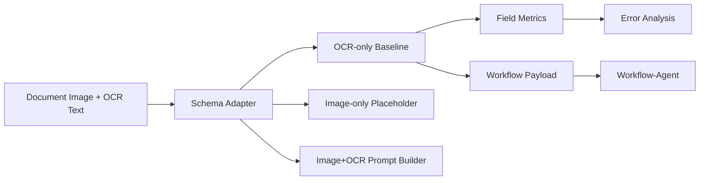

# FlowDoc-VLM

FlowDoc-VLM is a document-image field extraction and multimodal evaluation project for enterprise workflow scenarios.

The current week-1 MVP is intentionally limited to an **OCR-only baseline + evaluation pipeline**. It does not train, fine-tune, or report results for a large multimodal model yet.

## Naming

This project is named **FlowDoc-VLM**. It does not reproduce the existing DocVLM paper, does not claim a new document VLM architecture, and does not use the name DocVLM-FlowBench to avoid confusion with prior work.

## Why Enterprise Documents

Enterprise workflows often depend on uploaded forms, receipts, invoices, contracts, and access request screenshots. Workflow-Agent can move approval or ticket states, while FlowDoc-VLM extracts structured fields from document images and OCR text so the downstream workflow can validate risk, route human approval, and send notifications.

## Why Not Just OCR

FlowDoc-VLM is not a replacement for OCR. OCR-only is included as a baseline. The project studies where VLM-style document understanding can complement OCR/KIE:

- low-quality scans
- non-standard layouts
- missing or ambiguous field names
- multiple amount fields such as subtotal, tax, and total
- layout understanding after OCR structure is lost
- handwriting, stamps, and dense tables where field ownership is unclear

## Datasets

The week-1 MVP supports local CSV and mock fallback data. The generated mock set includes deliberately hard cases so the OCR-only baseline is not unrealistically perfect:

- subtotal, tax, total, amount due, and weak total labels
- invoice date and due date in the same OCR text
- vendor, company, client, and merchant names in the same document
- natural-language permission scope descriptions
- OCR lines with order different from the visual layout
- missing fields and non-standard labels

Adapter stubs are included for DocVQA, FUNSD, and SROIE-like records with TODO notes where public dataset schemas vary.

Recommended datasets:

- DocVQA: document visual question answering
- FUNSD: form understanding with entities and relations
- SROIE: scanned receipt OCR and key information extraction
- CORD: optional later expansion

Local CSV files can be placed under `data/raw/*.csv` with columns matching the unified schema: `sample_id`, `doc_id`, `doc_type`, `image_path`, `question`, `answer`, `field_name`, `field_type`, `ocr_text`, `bbox`, and `source_dataset`.

## Flow



## Quick Start

```bash
python -m pip install -e ".[dev]"
python scripts/prepare_mock_data.py
python scripts/run_field_eval.py
python scripts/export_error_cases.py
python scripts/demo_workflow_integration.py
python -m pytest -q
```

If `WORKFLOW_AGENT_URL` is set, the workflow demo will POST to that service. Otherwise it saves `outputs/workflow_payloads/payload.json` so the demo works offline.

## Current Capabilities

- unified Pydantic schema for VQA and field extraction samples
- mock document PNG and CSV generation
- local CSV adapter plus DocVQA/FUNSD/SROIE-like converter skeletons
- OCR-only rule baseline using `ocr_text`
- image-only placeholder with explicit unsupported status and no fabricated VLM metric
- image+OCR prompt construction
- exact match, normalized exact match, regex match, field accuracy, per-field accuracy, missing field rate, and multi-value conflict rate
- error case CSV export plus `outputs/error_cases/analysis_report.md`
- Workflow-Agent payload builder and optional client POST
- CPU-only pytest coverage without model downloads or API keys

`field_level_accuracy` is a baseline validation number on the current mock data, not the final model capability of FlowDoc-VLM. The deliberately hard mock cases are meant to expose common OCR-only failures before image+OCR prompting or VLM-SFT is introduced.

## Week 2 Plan

- connect Qwen2.5-VL or LLaVA
- build DocVQA/FUNSD/SROIE instruction-answer samples
- add answer-only label masking
- run LoRA SFT
- compare image-only, OCR-only, image+OCR, and VLM-SFT

## Week 3 Plan

- LoRA rank ablation
- OCR input granularity ablation
- field-type grouped evaluation
- end-to-end demo with Workflow-Agent

## Limitations

The week-1 image-only path does not call a real VLM and returns `unsupported`. The OCR baseline is deliberately simple and can fail on dense tables, missing labels, non-standard field names, OCR order changes, natural-language permission scopes, and ambiguous multi-value fields. All reported metrics are generated by scripts, not hand-written, and no VLM-SFT score is claimed before that model path exists.
