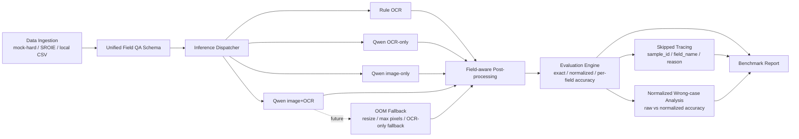

# FlowDoc-VLM

FlowDoc-VLM is an engineering benchmark system for document-image field extraction. It compares rule-based OCR extraction with Qwen2.5-VL input strategies, tracks skipped inference cases, and turns field-level errors into reproducible benchmark reports.

The project is evaluation-first: it does not claim a new VLM architecture, and it does not treat LoRA smoke runs as model-quality improvements.

## Project Overview

FlowDoc-VLM standardizes document field extraction into a unified field-QA schema:

- `image_path`: document image location
- `ocr_text`: OCR text associated with the image
- `field_name`: target field such as `company`, `date`, `address`, or `total_amount`
- `answer`: ground-truth field value
- metadata for dataset, document type, bounding boxes, and image availability

On top of this schema, the project runs multiple inference strategies under the same evaluation engine:

- rule OCR baseline
- Qwen2.5-VL OCR-only
- Qwen2.5-VL image-only
- Qwen2.5-VL image+OCR
- LoRA adapter evaluation scaffolding

## Why FlowDoc-VLM

Enterprise document workflows often need structured fields from receipts, invoices, forms, approvals, and access requests. OCR alone is cheap and useful, but it can fail when fields are long, multi-line, mislabeled, visually ambiguous, or mixed with nearby candidate values.

FlowDoc-VLM focuses on the engineering question: when does a VLM add value over OCR, how should that value be measured, and where do failures still happen?

The current evidence is intentionally modest and concrete:

- On real SROIE receipts, Qwen2.5-VL is substantially stronger than rule OCR.
- Image+OCR improves over Qwen OCR-only by about 5.1 percentage points on the same requested SROIE subset, but 8 rows were skipped due to CUDA OOM and require fallback handling.
- On synthetic mock-hard data, LoRA step10 and step50 did not improve accuracy; those runs only validate the training and adapter-evaluation chain.

## System Architecture



## Quick Start

Install the project and run the lightweight local checks:

```bash
python -m pip install -e ".[dev]"
python scripts/prepare_mock_data.py
python scripts/run_field_eval.py
python scripts/export_error_cases.py
python -m pytest -q
```

Run the SROIE real-data pipeline after placing local SROIE files under `data/raw/sroie/`:

```bash
python scripts/prepare_sroie_data.py --raw-dir data/raw/sroie --output data/processed/sroie_qa.csv --max-docs 100
python scripts/run_field_eval.py --input data/processed/sroie_qa.csv --output outputs/metrics/sroie_ocr_field_eval.json
python scripts/run_field_eval.py --input data/processed/sroie_qa_100.csv --output outputs/metrics/sroie_ocr_field_eval_100.json
python scripts/run_vlm_baseline.py --input data/processed/sroie_qa_100.csv --strategy ocr_only --backend qwen2_5_vl --model-name /root/autodl-tmp/models/Qwen/Qwen2___5-VL-3B-Instruct --output outputs/metrics/sroie_qwen_ocr_only_100.json
python scripts/run_vlm_baseline.py --input data/processed/sroie_qa_100.csv --strategy image_ocr --backend qwen2_5_vl --model-name /root/autodl-tmp/models/Qwen/Qwen2___5-VL-3B-Instruct --output outputs/metrics/sroie_qwen_image_ocr_100.json
python scripts/report_benchmark.py
python scripts/analyze_sroie_errors.py --predictions outputs/predictions/sroie_qwen_image_ocr_100_predictions.csv --output-dir outputs/analysis/sroie
```

The repository does not download SROIE data or model weights. If a model, image, or dependency is unavailable, VLM runs are marked as skipped rather than converted into fake metrics.

## Benchmark Results

### Table 1: SROIE Real-world Benchmark

| Method | Strategy | Accuracy | Evaluation Scope | Notes |
| --- | --- | ---: | --- | --- |
| Rule OCR | OCR text | 0.320 | 100 QA same-subset | Low-cost baseline |
| Qwen2.5-VL | OCR-only | 0.710 | 100 evaluated | Strong text-only VLM baseline |
| Qwen2.5-VL | image+OCR | 0.761 | 92 evaluated / 8 skipped | About +5.1 points over OCR-only; CUDA OOM fallback needed |

The full SROIE rule OCR run is `0.298` on 399 QA samples. The table above is the fairer same-subset comparison. The image+OCR score must be read as 92 evaluated out of 100 requested, because 8 QA rows were skipped due to CUDA OOM on two documents.

### Table 2: Mock-hard Ablation

| Method | Strategy | Accuracy | Notes |
| --- | --- | ---: | --- |
| OCR-only rule | OCR text | 0.769 | Synthetic hard-case baseline |
| Qwen2.5-VL zero-shot | image-only | 0.692 | No OCR text |
| Qwen2.5-VL zero-shot | OCR-only | 0.744 | Text-only VLM |
| Qwen2.5-VL zero-shot | image+OCR | 0.718 | Multimodal prompt |
| Qwen2.5-VL LoRA step10 | image+OCR | 0.718 | Smoke training only |
| Qwen2.5-VL LoRA step50 | image+OCR | 0.718 | Smoke training only |

LoRA smoke training validates the data, training, adapter-saving, and adapter-evaluation pathway. It did not demonstrate model improvement on mock-hard and should not be presented as an accuracy gain.

## Engineering Design

- Unified schema keeps OCR, VLM, and real-data adapters comparable.
- Prediction CSV names are derived from metrics output stems, preventing mock, SROIE, and LoRA runs from overwriting each other.
- Benchmark reporting filters out train logs, environment reports, readiness reports, and other non-benchmark JSON files.
- Same-subset comparison prevents misleading conclusions from full-vs-subset runs.
- Skipped tracing records unavailable model/image/OOM states by prediction file, sample ID, field name, and reason.
- Wrong-case analysis reports raw accuracy, normalized accuracy, per-field accuracy, and address-specific failures.
- Tests are CPU-safe and do not load Qwen models.

Related engineering notes:

- [SROIE benchmark report](docs/sroie_benchmark_report.md)
- [Engineering roadmap](docs/engineering_roadmap.md)
- [Address error plan](docs/address_error_plan.md)
- [ROI and deployment notes](docs/roi_and_deployment_notes.md)
- [Final project summary](docs/final_project_summary.md)

## Engineering Limitations

- The SROIE image+OCR 100 run has 8 skipped rows due to CUDA OOM.
- Address exact match is too strict to be the only address metric; token-level F1 or edit distance should be added.
- LoRA smoke training did not improve accuracy.
- The current real-data benchmark uses the first 100 documents from the SROIE train subset, not a full train/test evaluation.
- A unified benchmark CLI is still needed to reduce manual command sequencing.

## Roadmap

- Add OOM fallback with image resizing, max-pixel controls, and OCR-only fallback.
- Improve address post-processing and evaluation metrics.
- Consolidate data preparation, inference, evaluation, and report generation into a unified benchmark CLI.
- Expand SROIE evaluation to full train/test splits.
- Add CORD and FUNSD for broader document coverage.
